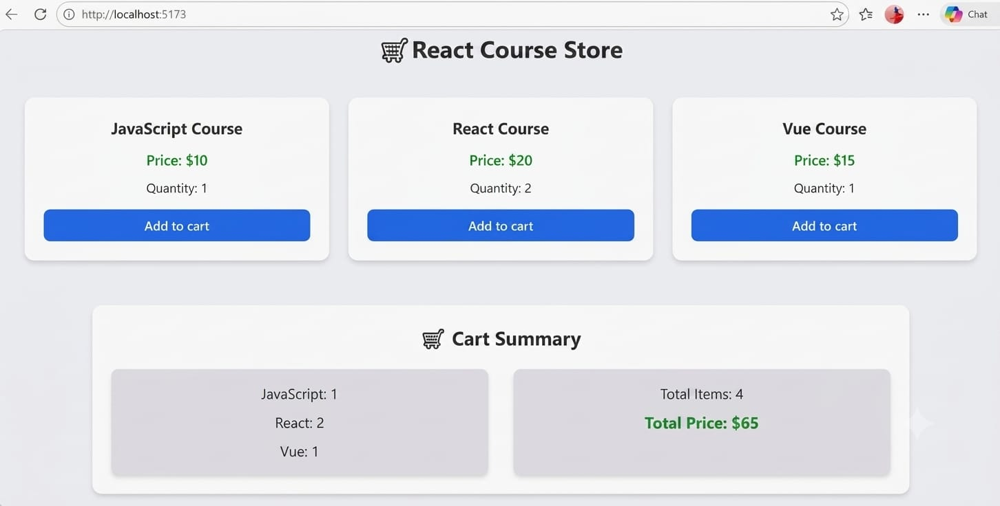

# 🛒 React Course Store

A simple React Course Store built to practice React state management, props, event handling, reusable components, and Tailwind CSS.

## 🚀 About the Project

This project is a small shopping-cart style application where users can add different courses to their cart and see the quantity, total items, and total price update dynamically.

## 📚 Courses

- ⚛️ React Course
- 🟢 Vue Course
- 🟨 JavaScript Course

## 🛠️ Technologies Used

- React
- JavaScript
- Tailwind CSS
- Vite

## ✨ Features

- Add courses to the cart
- Track quantity of each course
- Calculate total items dynamically
- Calculate total price dynamically
- Reusable "ProductCard" component
- Separate "CartSummary" component
- Responsive styling with Tailwind CSS

## 🧠 React Concepts Practiced

- "useState"
- State updater functions
- Props
- Parent → Child data flow
- Passing event handlers as props
- Component-based architecture
- Re-rendering after state updates
- Dynamic calculations

## 💡 Challenges

### While building this project, I practiced:

- Understanding how child components can trigger functions defined in the parent
- Updating nested state without losing existing values
- Passing the correct data through props
- Building the layout and spacing with Tailwind CSS

## 📂 Project Structure
```text
src/
├── components/
│   ├── ProductCard.jsx
│   └── CartSummary.jsx
│
├── ShoppingCart.jsx
└── main.jsx
```
## ▶️ Run Locally



Clone the repository:

git clone https://github.com/alishbatech/Learning-React-JS/tree/main/React-Shopping-Cart

Install dependencies:

npm install

Start the development server:

npm run dev

Then open the local URL provided by Vite.


## 🎯 Learning Outcome

This project helped me understand how state, props, event handlers, and reusable components work together in a real React application.

### Author

- Alishba Shahid

More projects coming as I continue my React journey 🚀